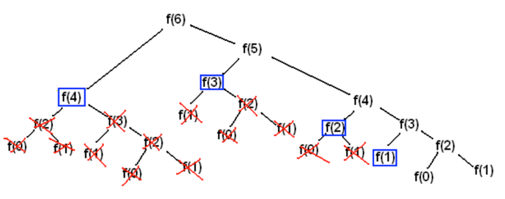

* TOC
{:toc}

> 이 글은 패스트 캠퍼스 [기술면접 완전 정복 올인원 패키지 Online](https://fastcampus.co.kr/dev_online_algo) 'Chapter 14. 동적 계획법(Dynamic Programming)과 분할 정복(Divide and Conquer)'의 강의내용을 정리하기 위해 강의 자료를 기반으로 작성한 글입니다.
>
> 강의 노트는 강의 구매자에게만 제공되는 자료이긴 하지만 잔재미 코딩의 [7. 동적 계획법 (Dynamic Programming)과 분할 정복 (Divide and Conquer)](https://www.fun-coding.org/Chapter14-dp_divide.html)에서 동일한 자료를 제공하고 있기 때문에 해당 자료를 기반으로 정리한 글을 작성해서 올립니다. 혹시 문제가 되는 경우 바로 내릴 예정이니 알려주시면 감사하겠습니다.
>
> 내용을 이해하기 위한 개인적인 설명이나 해석이 있을 수 있기 때문에 되도록 원문을 참고해주시길 바랍니다.
> 잘못된 부분이 있다면 댓글이나 그 외 편하신 방법으로 알려주시면 감사하겠습니다.

## 1. 정의

### 동적 계획법 (DP 라고 많이 부름)

* 입력 크기가 작은 부분 문제들을 해결한 후, 해당 부분 문제의 해를 활용해서, 큰 크기의 부분 문제를 해결, 최종적으로 전체 문제를 해결하는 알고리즘
* 상향식 접근법으로, 가장 최하위 해답을 구한 후, 이를 저장하고, 해당 결괏값을 이용해서 상위 문제를 풀어가는 방식
* Memoization 기법을 사용함
    * Memoization (메모이제이션) 이란: 프로그램 실행 시 이전에 계산한 값을 저장하여, 다시 계산하지 않도록 하여 전체 실행 속도를 빠르게 하는 기술
* 문제를 잘게 쪼갤 때, 부분 문제는 중복되어, 재활용됨
    * 예: 피보나치 수열

### 분할 정복

* 문제를 나눌 수 없을 때까지 나누어서 각각을 풀면서 다시 합병하여 문제의 답을 얻는 알고리즘
* 하향식 접근법으로, 상위의 해답을 구하기 위해, 아래로 내려가면서 하위의 해답을 구하는 방식
    * 일반적으로 재귀 함수로 구현
* 문제를 잘게 쪼갤 때, 부분 문제는 서로 중복되지 않음
    * 예: 병합 정렬, 퀵 정렬 등

## 2. 공통점과 차이점

### 공통점

* 문제를 잘게 쪼개서, 가장 작은 단위로 분할

### 차이점

* 동적 계획법
    * 부분 문제는 중복되어, 상위 문제 해결 시 재활용됨
    * Memoization 기법 사용 (부분 문제의 해답을 저장해서 재활용하는 최적화 기법으로 사용)
* 분할 정복
    * 부분 문제는 서로 중복되지 않음
    * Memoization 기법 사용 안 함

## 3. 동적 계획법 알고리즘 이해

### 프로그래밍 연습

피보나치 수열: n을 입력받아서 다음과 같이 계산됨

$$
F_n :=
\begin{cases}
   0 & \text{if} \quad n = 0\\
   1 & \text{if} \quad n = 1\\
   F_{n-1} + F_{n-2} & \text{if} \quad n > 1
\end{cases}
$$

```python
# 함수를 fibonacci 라고 하면,

fibonacci(0) # 0
fibonacci(1) # 1
fibonacci(2) # 1
fibonacci(3) # 2
fibonacci(4) # 3
fibonacci(5) # 5
fibonacci(6) # 8
fibonacci(7) # 13
fibonacci(8) # 21
fibonacci(9) # 34
```



* f(n)을 f(0), f(1)과 같은 작은 단위로 쪼개야 하고
* 그 과정에서 f(0), f(1) 등은 중복해서 여러 번 구한다는 점에서
* 동적 계획법의 예시라고 할 수 있다.

n을 입력받았을 때 피보나치 수열로 결괏값을 출력하세요

#### 재귀 호출을 활용

```python
def fibo(num):
    # num이 0이나 1이면
    if num <= 1:
        return num
    return fibo(num - 1) + fibo(num - 2)

# 테스트 코드
fibo(4) # 3
```

#### 동적 계획법 활용

```python
def fibo_dp(num):
    # 저장 공간을 생성한다.
    # 0 ~ num 까지의 인덱스에 각각 0을 저장
    cache = [ 0 for index in range(num + 1)]
      
    # 초깃값을 입력한다.
    cache[0] = 0
    cache[1] = 1

    # 나머지 값도 계산해서 대입한다.
    for index in range(2, num + 1):
        # 매번 1까지 계산하는 것이 아니라 이미 계산해 저장된 값을 바로 이용한다.
        cache[index] = cache[index - 1] + cache[index - 2]
    return cache[num]

# 테스트 코드
fibo(10) # 55
```

실행 코드를 보며 이해해보기: [코드 분석](http://www.pythontutor.com/live.html#mode=edit)

> 분할 정복 알고리즘의 예는 별도 챕터에서 다루는 병합 정렬과 퀵 정렬을 통해 이해
