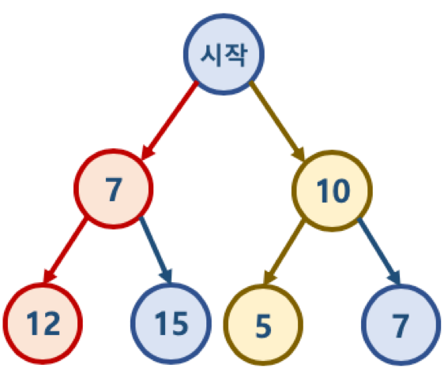

* TOC
{:toc}

> 이 글은 패스트 캠퍼스 [기술면접 완전 정복 올인원 패키지 Online](https://fastcampus.co.kr/dev_online_algo) 'Chapter 19. 탐욕 알고리즘의 이해'의 강의내용을 정리하기 위해 강의 자료를 기반으로 작성한 글입니다.
>
> 강의 노트는 강의 구매자에게만 제공되는 자료이긴 하지만 잔재미 코딩의 [4. 탐욕 알고리즘의 이해](https://www.fun-coding.org/Chapter19-greedy-live.html)에서 동일한 자료를 제공하고 있기 때문에 해당 자료를 기반으로 정리한 글을 작성해서 올립니다. 혹시 문제가 되는 경우 바로 내릴 예정이니 알려주시면 감사하겠습니다.
>
> 내용을 이해하기 위한 개인적인 설명이나 해석이 있을 수 있기 때문에 되도록 원문을 참고해주시길 바랍니다.
> 잘못된 부분이 있다면 댓글이나 그 외 편하신 방법으로 알려주시면 감사하겠습니다.

## 1. 탐욕 알고리즘이란?

* Greedy algorithm 또는 탐욕 알고리즘이라고 불림
* 최적의 해에 가까운 값을 구하기 위해 사용됨
    * 완전히 최적의 해라고 보기는 어렵다.
* 여러 경우 중 하나를 결정해야 할 때마다, *매 순간 최적이라고 생각되는 경우를 선택*하는 방식으로 진행해서, 최종적인 값을 구하는 방식

## 2. 탐욕 알고리즘 예

### 문제 1: 동전 문제

지불해야 하는 값이 4720원 일 때 1원 50원 100원, 500원 동전으로 동전의 수가 가장 적게 지불하시오.

* 가장 큰 동전부터 최대한 지불해야 하는 값을 채우는 방식으로 구현 가능
* 탐욕 알고리즘으로 매 순간 최적이라고 생각되는 경우를 선택하면 됨
* 지금 순간에 가장 큰 값을 갖는 동전만 고려하기 때문에 탐욕 알고리즘으로 볼 수 있다.

```python
# 리스트를 내림차순으로 정렬

coin_list = [1, 100, 50, 500]
print(coin_list)
# [1, 100, 50, 500]

coin_list.sort(reverse=True)
print(coin_list)
# [500, 100, 50, 1]
```

```python
coin_list = [500, 100, 50, 1]

def min_coin_count(value, coin_list):
    # 동전의 개수
    total_coin_count = 0
    # 어떤 동전이 몇 개 사용됐는지를 나타낸 함수
    details = list()
    # 동전을 내림차순으로 정렬
    # 큰 값의 동전부터 사용하기 위함
    coin_list.sort(reverse=True)
    
    for coin in coin_list:
        # 코인을 값으로 나눈 몫이 동전의 개수가 된다.
        coin_num = value // coin
        total_coin_count += coin_num
        value -= coin_num * coin
        details.append([coin, coin_num])
    return total_coin_count, details

min_coin_count(4720, coin_list)
# (31, [[500, 9], [100, 2], [50, 0], [1, 20]])
```

### 문제2: 부분 배낭 문제 (Fractional Knapsack Problem)

무게 제한이 k인 배낭에 최대 가치를 가지도록 물건을 넣는 문제

* 각 물건은 무게(w)와 가치(v)로 표현될 수 있음
* 물건은 쪼갤 수 있기 때문에 물건 일부분이 배낭에 넣어질 수 있음, 그래서 Fractional Knapsack Problem으로 부름
    * Fractional Knapsack Problem의 반대로 물건을 쪼개서 넣을 수 없는 배낭 문제도 존재함 (0/1 Knapsack Problem으로 부름)


* 현재 상황에서 최적의 선택은 무게 대비 가치가 높은 것.
    * 물건 1과 5를 비교했을 때, 물건 1을 넣는 것이 이득이다.

```python
data_list = [(10, 10), (15, 12), (20, 10), (25, 8), (30, 5)]

# capacity: 무게 제한
def get_max_value(data_list, capacity):
    # 무게(x[0]) 대비 가격(x[1])을 기준으로 내림차순으로 정렬한다.
    data_list = sorted(data_list, key=lambda x: x[1] / x[0], reverse=True)
    # 배낭 안의 전체 가치
    total_value = 0
    details = list()

    for data in data_list:
        # 현재 원소의 무게가 제한 이내이면
        # 물건을 통째로 넣는다.
        if capacity - data[0] >= 0:
            # 제한에서 해당 물건의 무게를 빼준다.
            capacity -= data[0]
            # 전체 값에는 해당 물건의 가치를 더해준다.
            total_value += data[1]
            # fraction을 1로 해당 물건을 details에 추가한다.
            details.append([data[0], data[1], 1])
        else:
            # 물건이 얼마나(fraction) 들어갈 수 있는지 구한다.
            fraction = capacity / data[0]
            # 위의 비율만큼 가치를 더해준다.
            total_value += data[1] * fraction
            # fraction을 위의 비율로 해당 물건을 details에 추가한다.
            details.append([data[0], data[1], fraction])
            # 더는 물건을 넣을 수 없기 때문에 break
            break
    return total_value, details

get_max_value(data_list, 30)
# (24.5, [[10, 10, 1], [15, 12, 1], [20, 10, 0.25]])
# 무게가 10, 15인 물건은 온전히 들어갔고
# 무게가 20인 물건은 1/4만 들어갔다.
```

## 3. 탐욕 알고리즘의 한계

* 탐욕 알고리즘은 근사치 추정에 활용
* 반드시 최적의 해를 구할 수 있는 것은 아니기 때문
* 최적의 해에 가까운 값을 구하는 방법의 하나임

### 예시



'시작' 노드에서 시작해서 가장 작은 값을 찾아 leaf node 까지 가는 경로를 찾을 시에

* Greedy 알고리즘 적용 시 '시작 -> 7 -> 12'를 선택하게 되므로 7 + 12 = 19가 됨
* 하지만 실제 가장 작은 값은 '시작 -> 10 -> 5' 이며, 10 + 5 = 15가 답
