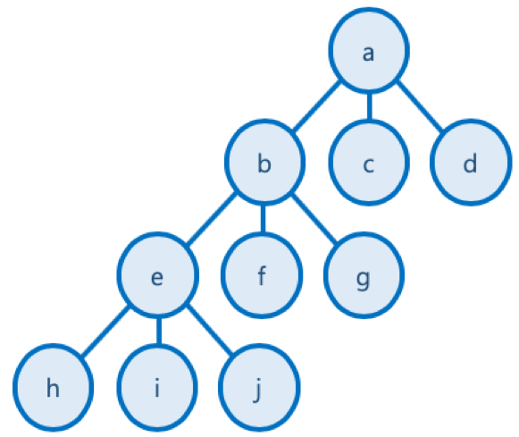
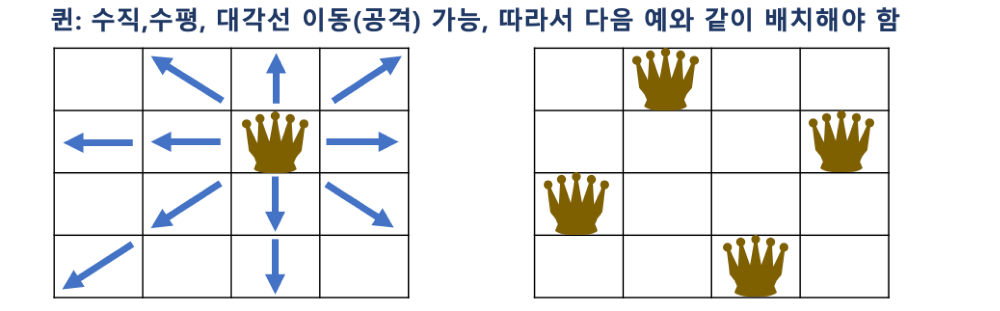
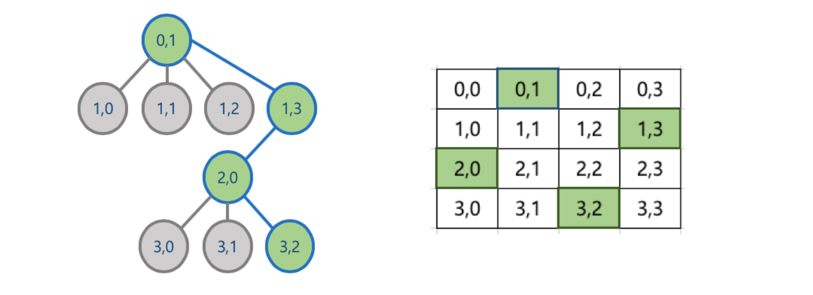
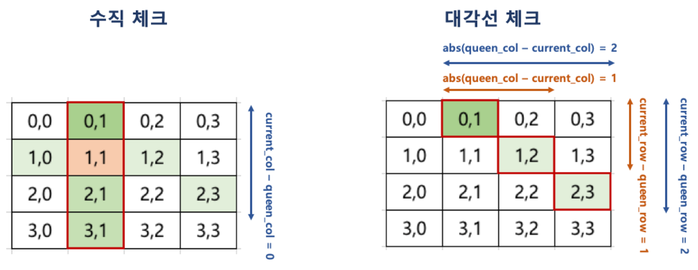

* TOC
{:toc}

> 이 글은 패스트 캠퍼스 [기술면접 완전 정복 올인원 패키지 Online](https://fastcampus.co.kr/dev_online_algo) 'Chapter 21. 백 트래킹'의 강의내용을 정리하기 위해 강의 자료를 기반으로 작성한 글입니다.
>
> 강의 노트는 강의 구매자에게만 제공되는 자료이긴 하지만 잔재미 코딩의 [8. 백 트래킹 기법의 이해](https://www.fun-coding.org/Chapter21-backtracking-live.html)에서 동일한 자료를 제공하고 있기 때문에 해당 자료를 기반으로 정리한 글을 작성해서 올립니다. 혹시 문제가 되는 경우 바로 내릴 예정이니 알려주시면 감사하겠습니다.
>
> 내용을 이해하기 위한 개인적인 설명이나 해석이 있을 수 있기 때문에 되도록 원문을 참고해주시길 바랍니다.
> 잘못된 부분이 있다면 댓글이나 그 외 편하신 방법으로 알려주시면 감사하겠습니다.

## 1. 백 트래킹 (backtracking)

* 백트래킹 (backtracking) 또는 퇴각 검색 (backtrack)으로 부름
* 제약 조건 만족 문제 (Constraint Satisfaction Problem)에서 해를 찾기 위한 전략
    * 해를 찾기 위해, 후보군에 제약 조건을 점진적으로 체크하다가,
    * 해당 후보군이 제약 조건을 만족할 수 없다고 판단되는 즉시 backtrack (다시는 이 후보군을 체크하지 않을 것을 표기)하고,
    * 바로 다른 후보군으로 넘어가며, 결국 최적의 해를 찾는 방법
    * 계산의 양을 줄일 수 있다.
* 실제 구현 시, 고려할 수 있는 모든 경우의 수(후보군)를 상태 공간 트리(State Space Tree)를 통해 표현
    * 각 후보군을 DFS 방식으로 확인
    * 상태 공간 트리를 탐색하면서, 제약이 맞지 않으면 해의 후보가 될만한 곳으로 바로 넘어가서 탐색
        * Promising: 해당 루트가 조건에 맞는지를 검사하는 기법
        * Pruning (가지치기): 조건에 맞지 않으면 포기하고 다른 루트로 바로 돌아서서, 탐색의 시간을 절약하는 기법

> 즉, 백트래킹은 트리 구조를 기반으로 DFS로 깊이 탐색을 진행하면서 각 루트에 대해 조건에 부합하는지 체크(Promising), 만약 해당 트리(나무)에서 조건에 맞지 않는 노드는 DFS로 깊이 탐색을 더 진행하지 않고, 가지를 쳐버림 (Pruning)

### 상태 공간 트리 (State Space Tree)

문제 해결 과정의 중간 상태를 각각의 노드로 나타낸 트리



## 2. N Queen 문제 이해

N x N 크기의 체스판에 N개의 퀸을 서로 공격할 수 없도록 배치하는 문제

* 대표적인 백트래킹 문제
* 퀸은 다음과 같이 이동할 수 있기 때문에, 배치된 퀸 간에 공격할 수 없는 위치로 배치해야 함



### Pruning (가지치기) for N Queen 문제

* 한 행에는 하나의 퀸밖에 위치할 수 없음
    * 퀸은 수평 이동이 가능하므로
* 맨 위에 있는 행부터 퀸을 배치하고, 다음 행에 해당 퀸이 이동할 수 없는 위치를 찾아 퀸을 배치
* 만약 앞선 행에 배치한 퀸으로 인해, 다음 행에 해당 퀸들이 이동할 수 없는 위치가 없을 때는, 더 이상 퀸을 배치하지 않고, 이전 행의 퀸의 배치를 바꿈
    * 즉, 맨 위의 행부터 전체 행까지 퀸의 배치가 가능한 경우의 수를 상태 공간 트리 형태로 만든 후, 각 경우를 맨 위의 행부터 DFS 방식으로 접근, 해당 경우가 진행이 어려우면, 더 이상 진행하지 않고, 다른 경우를 체크하는 방식



### Promising for N Queen 문제

* 해당 루트가 조건에 맞는지를 검사하는 기법을 활용하여,
* 현재까지 앞선 행에서 배치한 퀸이 이동할 수 없는 위치가 있는지를 다음과 같은 조건으로 확인
    * 한 행에 어차피 하나의 퀸만 배치 가능하므로 수평 체크는 별도로 필요하지 않음



## 3. N Queen 문제 파이썬 코드 작성

```python
# 수직 체크 & 대각선 체크를 하는 함수
def is_available(candidate, current_col):
    # 행은 0부터 시작하기 때문에
    # 현재 행은 candidate의 원소 수와 같다.
    current_row = len(candidate)
    # 첫 행부터 현재 직전 행까지
    for queen_row in range(current_row):
        # 해당 행의 (queen_row) 퀸의 열(candidate[queen_row) 값이 현재 열과 같거나
        # 둘의 차이가, 현재 행과 퀸의 행의 차이와 같으면
        if candidate[queen_row] == current_col or abs(candidate[queen_row] - current_col) == current_row - queen_row:
            # False를 반환한다.
            return False
    return True


# N: 개수
# current_row: 현재 행 (재귀 호출을 이용할 예정)
# current_candidate: 지금까지 놓은 퀸의 위치정보
# final_result: 전체 배치를 넣을 리스트
def DFS(N, current_row, current_candidate, final_result):
    # 종결 조건
    # 마지막 행에 도달하면
    if current_row == N:
        # current_candidate를 final_result에 추가하고
        # current_candidate가 아닌 그 복사본을 추가한다.
        final_result.append(current_candidate[:])
        # 함수 실행을 종료한다.
        return

    # 각 행의 N개의 열에 대해서
    for candidate_col in range(N):
        # 퀸이 될 수 있는지 조건을 체크해서 만족하면
        # current_candidate: 이미 배치된 퀸의 정보와
        # canditate_col: 현재 열
        if is_available(current_candidate, candidate_col):
            # 현재 열을 current_candidate에 추가한다.
            current_candidate.append(candidate_col)
            # 다음 행을 탐색
            DFS(N, current_row + 1, current_candidate, final_result)
            # 다음 행을 탐색했을 때 아무 좌표도 추가되지 않고 그냥 반환되면
            # 직전에 넣은 열은 조건을 만족하지 못 하므로 더는 고려할 필요가 없기 때문에
            # current_candidate에서 pop 한다.
            current_candidate.pop()


# N: 퀸의 개수
def solve_n_queens(N):
    # 배치된 위치
    final_result = []
    DFS(N, 0, [], final_result)
    return final_result

solve_n_queens(4)
# [[1, 3, 0, 2], [2, 0, 3, 1]]
# 체스판에 놓을 수 있는 조합은 총 두 개이다.
# (0,1), (1,3), (2, 0), (3, 2)
# (0,2), (1,0), (2, 3), (3, 1)
```
