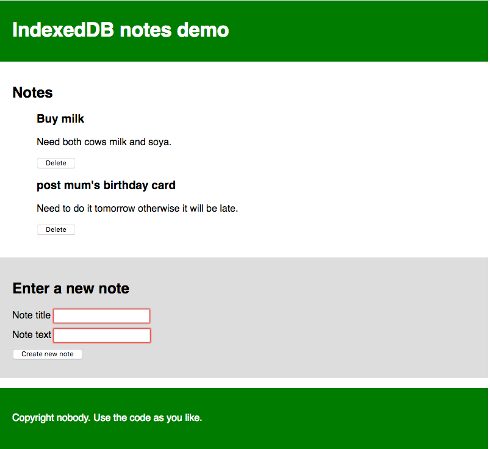

* TOC
{:toc}

> 이 글은 MDN Learn web development의 [Client-side web APIs](https://developer.mozilla.org/en-US/docs/Learn/JavaScript/Client-side_web_APIs) 중 [Client-side storage](https://developer.mozilla.org/en-US/docs/Learn/JavaScript/Client-side_web_APIs/Client-side_storage)의 내용을 번역 및 정리한 글입니다.
>
> * 제가 필요한 부분 위주로 확인하면서 정리하고 있어 글에 덜 작성된 부분이 있을 수 있습니다.
> * 글 작성 후 원문의 내용이 수정되거나 내용을 이해하기 위한 개인적인 설명이나 해석이 있을 수 있습니다. 되도록 원문을 참고해주시길 바랍니다.
> * 잘못된 부분이 있다면 댓글이나 그 외 편하신 방법으로 알려주시면 감사하겠습니다.

## 클라이언트 측 저장소? (Client-side storage?)

MDN 학습 영역의 다른 곳에서 [정적 사이트](https://developer.mozilla.org/en-US/docs/Learn/Server-side/First_steps/Client-Server_overview#static_sites)와 [동적 사이트](https://developer.mozilla.org/en-US/docs/Learn/Server-side/First_steps/Client-Server_overview#dynamic_sites)의 차이점에 대해서 얘기했었다. 대부분의 주요 최신 웹 사이트는 동적이다 - 이들은 일종의 데이터베이스(서버 측 저장소)를 사용해서 데이터를 서버에 저장하고, [서버 측](https://developer.mozilla.org/en-US/docs/Learn/Server-side)의 코드를 실행해 필요한 데이터를 가져와, 정적 페이지 템플릿에 삽입하고, 사용자의 브라우저에 표시될 결과 HTML을 클라이언트에 제공한다.

클라이언트 측 저장소는 비슷한 원리로 작동하지만, 다른 용도를 갖는다. 이는 클라이언트(i.e. 사용자의 기기)에 데이터를 저장해 필요할 때 가져올 수 있도록 해주는 자바스크립트 API로 구성되어 있다. 이것은 다음과 같은 여러 뚜렷한(distinct) 용도를 갖는다:

* 사이트 환경 설정을 개인화한다 (e.g. 사용자의 사용자 설정 위젯, 색상 시스템, 폰트 사이즈 선택을 보여주기).
* 이전 사이트 활동을 유지한다 (e.g. 이전 세션의 장바구니 내용을 저장하고, 사용자가 이전에 로그인한 것을 기억하기).
* 사이트가 더 빠르게 (그리고 잠재적으로 덜 비싸게) 데이터와 자료(assets)를 다운로드하거나 네트워크 연결 없이도 쓸 수 있도록 이를 지역적으로 저장한다.
* 웹 애플리케이션에서 만들어진 문서를 오프라인에서도 사용할 수 있도록 저장한다.

클라이언트 측과 서버 측 저장소는 종종 함께 사용된다. 예를 들어, (아마 웹 게임이나 음악 재생 애플리케이션에서 사용되는) 음악 파일 묶음을 다운로드하고, 클라이언트 측 데이터베이스에 저장한 뒤, 필요할 때 재생할 수 있다. 사용자는 음악 파일을 한 번 다운로드 하면 된다 - 다음에 방문할 때는 음악을 데이터베이스에서 대신 가져올 것이다.

> Note: 클라이언트 측 저장소를 사용해서 저장할 수 있는 데이터의 양에 제한이 있다 (아마 개별 API와 누적 당 모두에); 정확한 제한은 브라우저와 아마 사용자 설정에 따라 달라진다. 더 많은 정보를 위해서는 [브라우저 저장소 제한과 퇴거 기준](https://developer.mozilla.org/en-US/docs/Web/API/IndexedDB_API/Browser_storage_limits_and_eviction_criteria)을 봐보자.

### 이전 방법: 쿠키 (Old school: Cookies)

클라이언트 측 저장소의 개념은 꽤 오래됐다. 웹의 초기부터, 사이트는 웹사이트에서의 개인화된 사용자 경험을 저장하기 위해 [쿠키](https://developer.mozilla.org/en-US/docs/Web/HTTP/Cookies)를 사용했다. 이들은 웹에서 일반적으로 사용된 클라이언트 측 저장소의 가장 초기 형태이다.

요즘엔, 클라이언트 측 데이터를 저장하는 더 쉬운 메커니즘이 존재해서, 이 글에서 쿠키를 사용하는 방법을 가르치지는 않을 것이다. 하지만, 이것이 쿠키가 최신의 웹에서 완전히 쓸모없다는 것을 의미하진 않는다 - 여전히 세션 ID나 엑세스 토큰과 같은 사용자 개인화와 상태에 관련된 데이터를 저장하는 데 일반적으로 사용된다. 쿠키에 대한 더 많은 정보는 [HTTP 쿠키 사용하기](https://developer.mozilla.org/en-US/docs/Web/HTTP/Cookies) 글을 보자.

### 새로운 방법: 웹 저장소와 인덱싱된 DB (New school: Web Storage and IndexedDB)

위에서 얘기한 더 "쉬운" 방법은 다음과 같다:

* [Web Storage API](https://developer.mozilla.org/en-US/docs/Web/API/Web_Storage_API)는 이름과 그에 해당하는 값으로 이루어진 작은 데이터 항목을 저장하고 불러오기 위한 기능을 제공한다. 이는 사용자의 이름, 로그인 여부, 화면의 배경색 등과 같은 간단한 데이터를 저장해야 할 때 유용하다.
* [IndexedDB API](https://developer.mozilla.org/en-US/docs/Web/API/IndexedDB_API)는 복잡한 데이터를 저장하기 위한 완전한 데이터베이스 시스템을 브라우저에 제공한다. 이는 완전한 사용자 기록 모음부터 오디오나 비디오 파일과 같은 복잡한 데이터 유형에까지 사용될 수 있다.
  
아래에서 이 API에 대해 더 배울 수 있다.

### 캐시 API (The Cache API)

[`Cache`](https://developer.mozilla.org/en-US/docs/Web/API/Cache) API는 특정 요청에 대한 HTTP 응답을 저장하기 위해 디자인되었으며, 나중에 네트워크 연결 없이도 사이트를 사용할 수 있도록 사이트의 웹 사이트 자원을 오프라인에 저장하는 것과 같은 일을 할 때 매우 유용하다. 캐시는, 그럴 필요는 없긴 하지만, 주로 [Service Worker API](https://developer.mozilla.org/en-US/docs/Web/API/Service_Worker_API)와 함께 사용된다.

캐시와 서비스 워커는 고급 주제로, 아래의 [오프라인 자료 저장](https://developer.mozilla.org/en-US/docs/Learn/JavaScript/Client-side_web_APIs/Client-side_storage#offline_asset_storage) 섹션의 예제에서 보여줄 것이긴 하지만, 이 글에서 크게 자세하게 다루지는 않을 것이다.

## 간단한 데이터를 저장하기 - 웹 저장소 (Storing simple data — web storage)

[Web Storage API](https://developer.mozilla.org/en-US/docs/Web/API/Web_Storage_API)는 굉장히 사용하기 쉽다 - 간단한 데이터의 이름/값 쌍을 저장하고 (문자열, 숫자 등에 제한된다), 필요할 때 이 값을 불러온다.

### 기본 문법 (Basic syntax)

어떻게 하는지 보여주면:

1. 우선 제공하는 GitHub의 [웹 저장소 빈 템플릿](https://mdn.github.io/learning-area/javascript/apis/client-side-storage/web-storage/index.html)으로 이동한다 (새 탭에서 열자).
1. 브라우저 개발자 도구의 자바스크립트 콘솔을 연다.
1. 모든 웹 저장소 데이터는 브라우저 안의 두 객체 같은 구조체에 포함되어있다: [`sessionStorage`](https://developer.mozilla.org/en-US/docs/Web/API/Window/sessionStorage)와 [`localStorage`](https://developer.mozilla.org/en-US/docs/Web/API/Window/localStorage).
    * 첫 번째는 브라우저가 열려있는 이상 데이터를 유지한다 (브라우저가 닫히면 데이터를 잃는다).
    * 두 번째는 브라우저가 닫히고 다시 열렸을 때도 데이터를 유지한다.
    * 두 번째가 일반적으로 더 유용하기 때문에 이 글에서는 두 번째를 사용할 것이다.
    * [`Storage.setItem()`](https://developer.mozilla.org/en-US/docs/Web/API/Storage/setItem) 메소드는 저장소에 데이터 항목을 저장할 수 있도록 해준다 - 이 메소드는 두 매개변수를 받는다: 항목의 이름과 그 값
    * 이 코드를 자바스크립트 콘솔에 입력해보자 (원한다면 값을 자신의 이름으로 바꿔도 된다!).

    ```js
    localStorage.setItem('name','Chris');
    ```

1. [`Storage.getItem()`](https://developer.mozilla.org/en-US/docs/Web/API/Storage/getItem) 메소드는 한 개의 매개변수를 받는다 - 가져오려는 데이터 항목의 이름 - 그리고 항목의 값을 반환한다. 이제 다음의 코드를 자바스크립트 콘솔에 입력해보자:

    ```js
    let myName = localStorage.getItem('name');
    myName
    ```

    * 두 번째 줄을 입력하면, `myName` 변수가 `name` 데이터 항목의 값을 포함한다는 것을 볼 수 있다.

1. [`Storage.removeItem()`](https://developer.mozilla.org/en-US/docs/Web/API/Storage/removeItem) 메소드는 한 개의 매개변수를 받는다 - 제거하려는 데이터 항목의 이름 - 그리고 해당 항목을 웹 저장소에서 제거한다. 다음의 코드를 자바스크립트 콘솔에 입력해보자:

    ```js
    localStorage.removeItem('name');
    myName = localStorage.getItem('name');
    myName
    ```

    * 세 번째 코드는 `null`을 반환할 것이다 - `name` 항목은 웹 저장소에 더는 존재하지 않는다.

### 데이터는 유지된다! (The data persists!)

웹 저장소의 주요한 기능 중 하나는 데이터가 페이지 로드 사이에 (그리고 `localStorage`의 경우는 브라우저가 꺼지더라도) 저장된다는 것이다. 실제로 봐보자.

1. 웹 저장소 빈 템플릿을, 이번에는 이 튜토리얼이 열려 있는 브라우저와 다른 브라우저에서, 다시 연다. 이러면 템플릿을 다루기 더 쉬울 것이다.
2. 다음의 코드를 브라우저의 자바스크립트 콘솔에 입력한다:

    ```js
    localStorage.setItem('name','Chris');
    let myName = localStorage.getItem('name');
    myName
    ```

    * 이름 항목이 반환되는 것을 볼 것이다.

1. 이제 브라우저를 닫고 다시 연다.
1. 다음의 코드를 다시 입력한다:

    ```js
    let myName = localStorage.getItem('name');
    myName
    ```

    * 브라우저가 닫히고 다시 열렸지만, 해당 값이 여전히 사용 가능하다는 것을 볼 수 있다.

### 각 도메인을 위한 개별 저장소 (Separate storage for each domain)

도메인(브라우저에 로드된 개별 웹 주소)마다 별도의 데이터 저장소가 있다. 만약 두 웹사이트(google.com과 amazon.com이라고 하자)를 불러오고 한 개의 웹사이트에서 항목을 저장하려고 하면, 다른 웹사이트에서는 이를 사용할 수 없다는 것을 확인할 수 있다.

이것은 납득이 된다 - 만약 웹사이트가 서로의 데이터를 볼 수 있다면 보안 문제가 발견될 것이라는 것을 예상(imagine)할 수 있다.

### 더 복잡한 예제 (A more involved example)

웹 저장소가 어떻게 사용되는지에 대한 아이디어를 제공하기 위해, 작업 에제를 작성해 이 새로운 지식을 적용해보자. 이 예제에서는 이름을 입력하고, 이후에 페이지를 업데이트해 개인화된 인사를 전할 수 있도록 할 것이다. 또한 이 상태는 이름이 웹 저장소에 저장되기 때문에 페이지/브라우저 리로드를 넘어 유지될 것이다.

예제 HTML은 [personal-greeting.html](https://github.com/mdn/learning-area/blob/main/javascript/apis/client-side-storage/web-storage/personal-greeting.html)에서 찾을 수 있다 - 이 HTML은 헤더, 내용, 푸터, 이름을 입력하는 양식으로 된 웹사이트를 포함한다.


예제가 어떻게 동작하는지 알 수 있게 예제를 만들어보자.

1. 우선 컴퓨터의 새로운 디렉토리에 [personal-greeting.html](https://github.com/mdn/learning-area/blob/main/javascript/apis/client-side-storage/web-storage/personal-greeting.html) 파일의 로컬 복사본을 저장하자.
1. 다음으로, HTML이 `<script src="index.js" defer></script>`와 같은 코드로 어떻게 `index.js`라는 자바스크립트 파일을 참조하고 있는지 확인하자. 이것을 생성해서 그 안에 자바스크립트 코드를 작성해야 한다. HTML 파일과 같은 디렉토리에 `index.js` 파일을 만든다.
1. 이 예제에서 우리가 조작해야 할 모든 HTML 기능에 대한 참조를 만드는 것부터 시작할 것이다 - 이런 참조는 앱의 수명 주기에서 변하지 않기 때문에, 모든 참조는 상수로 생성할 것이다. 다음의 코드를 자바스크립트 파일에 추가하자:

    ```js
    // 필요한 상수 생성
    const rememberDiv = document.querySelector('.remember');
    const forgetDiv = document.querySelector('.forget');
    const form = document.querySelector('form');
    const nameInput = document.querySelector('#entername');
    const submitBtn = document.querySelector('#submitname');
    const forgetBtn = document.querySelector('#forgetname');

    const h1 = document.querySelector('h1');
    const personalGreeting = document.querySelector('.personal-greeting');
    ```

1. 다음으로, 제출 버튼이 눌렸을 때 양식이 실제로 제출되는 것은 우리가 원하는 동작이 아니므로, 이를 막기 위해 작은 이벤트 리스너를 하나 포함해야 한다. 이전의 코드 아래에 다음의 스니펫을 추가하자:

    ```js
    // 버튼이 눌렸을 때 양식이 제출되는 것을 막는다
    form.addEventListener('submit', e => e.preventDefault());
    ```

1. 이제 "Say hello" 버튼을 눌렀을 때 실행될 핸들러 함수로 이벤트 리스너를 추가해야 한다. 코드의 각 부분이 무엇을 하는지 주석으로 설명하고 있지만, 여기서 본질적으로는 사용자가 텍스트 입력 박스에 입력한 이름을 가져와서 `setItem()`을 사용해 웹 저장소에 저장한 다음, 실제 웹사이트 텍스트의 업데이트를 처리하는 `nameDisplayCheck()`라는 함수를 실행한다. 이것을 코드 가장 아래에 추가하자:

    ```js
    // 'Say hello' 버튼이 눌렸을 때 함수를 실행
    submitBtn.addEventListener('click', () => {
      // 입력된 이름을 웹 저장소에 저장
      localStorage.setItem('name', nameInput.value);
      // nameDisplayCheck()을 실행해 개인화된 인사말을 표시하고 양식 화면을 갱신
      nameDisplayCheck();
    });
    ```

1. 이쯤에서 "Forget" 버튼이 눌렸을 때 실행될 함수의 이벤트 핸들러도 필요하다 - 이것은 "Say hello" 버튼이 눌린 다음에만 표시된다 (두 양식 상태를 전후로 전환한다). 이 함수에서는 `removeItem()`을 사용해 `name` 항목을 웹 저장소에서 제거한 다음, 다시 `nameDisplayCheck()`를 실행해 화면을 갱신한다. 다음을 마지막에 추가하자:

    ```js
    // 'Forget' 버튼이 눌렸을 때 함수를 실행
    forgetBtn.addEventListener('click', () => {
      // 웹 저장소에서 저장된 name을 제거
      localStorage.removeItem('name');
      // nameDisplayCheck()을 실행해 일반 인사말을 표시하고 양식 화면을 갱신
      nameDisplayCheck();
    });
    ```

1. 이제 `nameDisplayCheck()` 함수 자체를 정의할 시간이다. 여기서는 조건 테스트로 `localStorage.getItem('name')`을 사용해 이름(name) 항목이 웹 저장소에 저장되어 있는지 확인한다. 만약 이름이 저장되어 있으면, 이 호출 값은 `true`일 것이다; 만약 그렇지 않다면 호출 값은 `false`일 것이다. 호출 값이 `true`라면, 개인화된 인사말과 양식의 "forget" 부분을 표시하고, 양식의 "Say hello" 부분은 숨긴다. 호출 값이 `false`라면, 일반 인사말을 표시하고 나머지를 반대로 한다. 또다시, 다음의 코드를 마지막에 추가하자:

    ```js
    // nameDisplayCheck() 함수를 정의
    function nameDisplayCheck() {
      // 'name' 데이터가 웹 저장소에 저장되어 있는지 확인
      if(localStorage.getItem('name')) {
        // 만약 저장되어 있으면, 개인화된 인사말을 표시
        const name = localStorage.getItem('name');
        h1.textContent = `Welcome, ${name}`;
        personalGreeting.textContent = `Welcome to our website, ${name}! We hope you have fun while you are here.`;
        // 양식의 'remember' 부분을 숨기고 'forget' 부분을 표시
        forgetDiv.style.display = 'block';
        rememberDiv.style.display = 'none';
      } else {
        // 저장되어 있지 않으면, 일반 인사말을 표시
        h1.textContent = 'Welcome to our website ';
        personalGreeting.textContent = 'Welcome to our website. We hope you have fun while you are here.';
        // 양식의 'forget' 부분을 숨기고 'remember' 부분을 표시
        forgetDiv.style.display = 'none';
        rememberDiv.style.display = 'block';
      }
    }
    ```

1. 마지막이지만 중요하게, 페이지가 로드되었을 때 `nameDisplayCheck()` 함수를 실행해야 한다. 만약 이를 하지 않으면, 개인화된 인사말이 페이지 리로드를 넘어 유지되지 않을 것이다. 다음을 코드 가장 아래에 추가하자:

    ```js
    nameDisplayCheck();
    ```

예제가 끝났다 - 잘했다! 이제 남은 것은 코드를 저장하고 브라우저에서 HTML 페이지를 테스트하는 것이다. [여기서 최종 버전의 실제 실행 예제](https://mdn.github.io/learning-area/javascript/apis/client-side-storage/web-storage/personal-greeting.html)를 확인할 수 있다.

> Note: [Web Storage API를 사용하기](https://developer.mozilla.org/en-US/docs/Web/API/Web_Storage_API/Using_the_Web_Storage_API)에 약간 더 복잡한 다른 예제가 있다.

> Note: 최종 버전 소스의 `<script src="index.js" defer></script>` 코드에, `defer` 속성은 [`<script>`](https://developer.mozilla.org/en-US/docs/Web/HTML/Element/script) 요소의 콘텐츠가 페이지 로드가 완료될 때까지 실행하지 않도록 지정한다.

## 복잡한 데이터를 저장하기 - IndexDB (Storing complex data — IndexedDB)

[IndexedDB API](https://developer.mozilla.org/en-US/docs/Web/API/IndexedDB_API)(종종 IBD로 축약)는 브라우저에서 사용할 수 있는 완전한 데이터베이스 시스템으로, 문자열이나 숫자 같은 간단한 값에 제한되지 않고 복잡한 관련 데이터를 저장할 수 있다. IndexedDB 인스턴스에는 비디오, 이미지 및 기타 거의 모든 것을 저장할 수 있다.

하지만, 이것에는 비용이 따른다: IndexedDB는 Web Storage API보다 사용하기 훨씬 복잡하다. 이 섹션에서는, IndexedDB로 할 수 있는 것 중 극히 일부만 다룰 것(scratch the surface)이지만, 시작하기에는 충분한 정보를 제공할 것이다.

### 노트 저장 예제 다루기 (Working through a note storage example)

여기서는 브라우저에 노트를 저장하고, 원할 때마다 보고, 제거할 수 있는 예제를 통해 진행할 것이며, 진행하면서 IDB의 가장 기본적인 부분을 설명하고 스스로 만들어갈 수 있도록 할 것이다.

앱은 다음과 같이 보인다:



각 노드는 제목과 본문 텍스트를 갖고, 각각 수정할 수 있다. 아래에서 진행할 자바스크립트 코드에는 코드가 무엇을 하는지 이해하는 데 도움을 줄 주석이 자세히 적혀있다.

### 시작하기 (Getting started)

1. 가장 먼저, 로컬 기기의 새로운 디렉토리 안에 [`index.html`](https://github.com/mdn/learning-area/blob/main/javascript/apis/client-side-storage/indexeddb/notes/index.html), [`style.css`](https://github.com/mdn/learning-area/blob/main/javascript/apis/client-side-storage/indexeddb/notes/style.css), [`index-start.js`](https://github.com/mdn/learning-area/blob/main/javascript/apis/client-side-storage/indexeddb/notes/index-start.js) 파일의 로컬 저장본을 만든다.
1. 파일들을 살펴보자.
    * HTML은 헤더, 푸터, 노트를 표시할 공간을 포함하는 메인 콘텐츠 영역, 데이터베이스에 새로운 노트를 입력하는 양식으로 이루어진 웹사이트를 정의하고 있다.
    * CSS는 무엇이 일어나는지 더 명확하게 보여줄 수 있는 스타일링을 제공한다.
    * 자바스크립트 파일은 노트가 위치할 [`<ul>`](https://developer.mozilla.org/en-US/docs/Web/HTML/Element/ul)요소, 제목과 본문 [`<input>`](https://developer.mozilla.org/en-US/docs/Web/HTML/Element/input)요소, [`<form>`](https://developer.mozilla.org/en-US/docs/Web/HTML/Element/form) 자체, [`<button>`](https://developer.mozilla.org/en-US/docs/Web/HTML/Element/button)에 대한 참조를 포함하는 다섯 개의 선언된 상수를 포함한다.
1. 자바스크립트 파일의 이름을 `index.js`로 바꾸자. 이제 파일에 코드를 추가할 준비가 되었다.

### 데이터베이스 초기 설정 (Database initial set up)

이제 실제로 데이터베이스를 설정하기 위해 가장 먼저 무엇을 해야 하는지 살펴보자.

1. 상수 선언 아래에 다음의 코드를 추가한다:

    ```js
    // 연 데이터베이스를 저장하기 위해 db 객체의 인스턴스를 생성한다
    let db;
    ```

    * 여기서는 `db`라는 변수를 선언한다 - 이것은 나중에 데이터베이스를 나타낼 객체를 저장하는 데 쓰일 것이다.
    * 이 변수는 몇몇 곳에서 쓸 것이기 때문에, 다른 것을 쉽게 만들기 위해 변수를 전역적으로 선언한다.

1. 다음으로, 다음의 코드를 추가한다:

    ```js
    // 데이터베이스를 연다; 만약 존재하지 않으면 새로 생성된다
    // (아래 업그레이드된 핸들러를 참고하자)
    const openRequest = window.indexedDB.open('notes_db', 1);
    ```

    * 이 코드는 `notes_db`라는 데이터베이스의 버전 `1`을 여는 요청을 생성한다. 만약 데이터베이스가 존재하지 않으면, 다음의 코드에서 만들어질 것이다.
        * 앞으로 IndexedDB에서 이 요청 패턴이 매우 빈번하게 쓰이는 것을 볼 것이다.
    * 데이터베이스는 동작은 시간이 걸린다. 결과를 기다리는 동안 브라우저가 멈춰있는 것을 원하지 않을 것이므로, 데이터베이스의 동작은 [비동기적](https://developer.mozilla.org/en-US/docs/Glossary/Asynchronous)이며, 이는 동작이 즉시 이루어지는 것이 아니라 미래의 어느 시점에서 이루어지고, 완료됐을 때 알림을 받는다는 것을 의미한다.
    * 이를 IndexedDB에서 처리하려면, 요청 객체를 생성한다.
        * 객체는 원하는 대로 부를 수 있으며 - 여기서는 용도가 무엇인지 명확히 할 수 있도록 `openRequist`라고 부른다.
    * 그다음 이벤트 핸들러를 사용해 요청이 완료되거나, 실패하거나, 그 외의 상태가 됐을 때 코드를 실행한다. 아래에서 이벤트 핸들러가 사용되는 것을 볼 것이다.

    > Note: 버전 숫자는 중요하다. 데이터베이스를 갱신하고 싶다면 (예를 들어, 테이블 구조를 바꿔서), 증가한 버전 숫자 값과, `ungradeneeded` 핸들러 (아래를 참고하자) 안에 지정된 다른 스키마 등과 함께 코드를 다시 실행해야 한다. 이 튜토리얼에서 데이터베이스 갱신은 다루지 않을 것이다.

1. 이제 다음의 이벤트 핸들러를 이전에 추가한 코드 바로 아래에 추가한다:

    ```js
    // 데이터베이스가 성공적으로 열리지 못했을 때를 나타내는 오류 핸들러
    openRequest.addEventListener('error', () => console.error('Database failed to open'));

    // 데이터베이스가 성공적으로 열렸다는 것을 나타내는 성공 핸들러
    openRequest.addEventListener('success', () => {
      console.log('Database opened successfully');

      // 열린 데이터베이스 객체를 db 변수에 저장한다. 이 변수는 아래에서 많이 쓰였다
      db = openRequest.result;

      // displayData() 함수를 실행해서 IDB에 이미 있는 노트를 표시
      displayData();
    });
    ```

    * [`error`](https://developer.mozilla.org/en-US/docs/Web/API/IDBRequest/error_event) 이벤트 핸들러는 시스템이 요청이 실패했다는 결과를 가져오면 실행된다.
        * `error` 이벤트는 해당 문제에 응답할 수 있도록 해준다. 현재 예제에서는 자바스크립트 콘솔에 메시지를 출력하기만 할 것이다.
    * [`success`](https://developer.mozilla.org/en-US/docs/Web/API/IDBRequest/success_event) 이벤트 핸들러는 요청이 성공적으로 반환되면 실행된다. 이는 데이터베이스가 성공적으로 열렸다는 것을 의미한다.
        * 이 경우에는, 열린 데이터베이스를 나타내는 객체를 [`openRequest.result`](https://developer.mozilla.org/en-US/docs/Web/API/IDBRequest/result) 속성에서 사용할 수 있고, 이를 통해 데이터베이스를 조작할 수 있다. 이것은 이후에 사용하기 위해 이전에 생성한 `db` 변수에 저장한다.
        * 또한 데이터베이스의 데이터를 [`<ul>`](https://developer.mozilla.org/en-US/docs/Web/HTML/Element/ul) 요소 안에 표시하는 `displayData()` 함수를 실행한다. 페이지가 로드되는 즉시 데이터베이스에 이미 존재하는 노트가 바로 표시될 수 있도록 이 함수를 지금 실행한다. 이후에 정의된 `displayData()`를 볼 수 있을 것이다.

1. 이 섹션의 마지막으로, 데이터베이스를 설정하는데 아마 가장 중요한 이벤트 핸들러를 추가할 것이다: [`upgradeneeded`](https://developer.mozilla.org/en-US/docs/Web/API/IDBOpenDBRequest/upgradeneeded_event). 이 핸들러는 데이터베이스가 아직 설정되지 않았거나, 현존하는 저장된 데이터베이스보다 더 큰 버전 값으로 열렸을 때 (업그레이드를 수행할 때) 실행된다. 이전 핸들러 아래에 다음의 코드를 추가하자:

    ```js
    // 아직 완료된 것이 없으면 데이터베이스 테이블을 설정
    openRequest.addEventListener('upgradeneeded', e => {

      // 열린 데이터베이스의 참조를 가져옴
      db = e.target.result;

      // 노트를 저장할 objectStore를 생성 (기본적으로 단일 테이블과 같이)
      // 자동으로 증가하는 키를 포함
      const objectStore = db.createObjectStore('notes_os', { keyPath: 'id', autoIncrement:true });

      // objectStore가 포함할 데이터 항목을 정의
      objectStore.createIndex('title', 'title', { unique: false });
      objectStore.createIndex('body', 'body', { unique: false });

      console.log('Database setup complete');
    });
    ```

    * 이것은 현재 데이터베이스의 스키마(구조)를 정의한 곳이다; 즉, 데이터베이스가 포함한 열 (혹은 필드)의 모음이다.
    * 여기서 처음으로는 이벤트 대상의 `result` 속성에서 존재하는 데이터베이스의 참조를 가져(grab)오며, 이는 `request` 객체이다.
        * 이것은 `success` 이벤트 핸들러 안의 `db = openRequest.result;`와 동일하지만,
        * 여기서는 (만약 필요하면) `upgradeneeded` 이벤트 핸들러가 `success` 이벤트 핸들러보다 전에 실행되고, 이 코드를 작성해주지 않으면 `db` 값을 사용할 수 없기 때문에 이 코드를 별도로 작성해주어야 한다.
    * 그다음으로 [`IDBDatabase.createObjectStore()`](https://developer.mozilla.org/en-US/docs/Web/API/IDBDatabase/createObjectStore)을 사용해 `notes_os`라고 불리는 열려있는 데이터베이스 안에 새로운 객체 저장소를 만든다. 이것은 전통적인 데이터베이스 시스템의 테이블 한 개와 같다.
    * 이것에 notes라는 이름을 붙이고, `id`라고 하는 `autoIncrement` 키 필드를 지정한다.
        * 새로운 레코드마다 자동으로 이 값이 오름차순으로 부여되므로 개발자는 이걸 명시적으로 지정할 설정할 필요가 없다.
        * `id` 필드는 키로서 레코드를 제거하거나 표시할 때와 같이 레코드를 고유하게 식별하기 위해 사용된다.
    * 또한 [`IDBObjectStore.createIndex()`](https://developer.mozilla.org/en-US/docs/Web/API/IDBObjectStore/createIndex) 메소드를 사용해 두 개의 다른 인덱스(필드)를 생성한다: (각 노트의 제목을 포함할) `title`과 (노트의 본문 텍스트를 포함할) `body`.

이렇게 데이터베이스 스키마를 설정한 채, 레코드를 데이터베이스에 추가하기 시작할 때, 각 레코드는 다음의 코드와 같은 객체로 나타날 것이다:

```js
{
  title: "Buy milk",
  body: "Need both cows milk and soy.",
  id: 8
}
```

### 데이터베이스에 데이터를 추가하기 (Adding data to the database)

이제 데이터베이스에 레코드를 어떻게 추가하는지 살펴보자. 현재 페이지의 양식을 사용해 할 수 있다.

이전에 작성한 이벤트 핸들러 아래에, 폼이 제출됐을 때 (제출 [`<button>`](https://developer.mozilla.org/en-US/docs/Web/HTML/Element/button)을 눌러 성공적인 양식 제출이 이루어질 때) `addData()`라는 함수를 실행하는 `submit` 이벤트 핸들러를 설정하는 다음의 코드를 추가하자:

```js
// 양식이 제출됐을 때 addData() 함수가 실행되도록 submit 이벤트 핸들러를 생성
form.addEventListener('submit', addData);
```

이제 `addData()` 함수를 정의하자. 다음의 코드를 이전 코드 아래 추가한다:

```js
// addData() 함수를 정의
function addData(e) {
  // 기본 동작을 방지 - 전통적인 방식으로 양식을 제출하길 원하지 않는다
  e.preventDefault();

  // 양식 필드에 입력된 값을 가져와 DB에 삽입될 준비를 하는 객체에 저장
  const newItem = { title: titleInput.value, body: bodyInput.value };

  // read/write db 트랜잭션을 열고, 데이터 추가할 준비
  const transaction = db.transaction(['notes_os'], 'readwrite');

  // 데이터베이스에 추가된 객체 저장소를 호출
  const objectStore = transaction.objectStore('notes_os');

  // newItem 객체를 객체 저장소에 추가하기 위한 요청을 생성
  const addRequest = objectStore.add(newItem);

  addRequest.addEventListener('success', () => {
    // 양식을 비우고, 다음 항목을 추가하기 위해 준비
    titleInput.value = '';
    bodyInput.value = '';
  });

  // 모든 것이 끝나면 트랜잭션 완료의 성공을 알림
  transaction.addEventListener('complete', () => {
    console.log('transaction completed: database modification finished.');

    // 새로 추가된 항목을 보여주기 위해 displayData()를 다시 실행해 데이터 화면을 업데이트
    displayData();
  });

  transaction.addEventListener('error', () => console.log('transaction not opened due to error'));
}
```

위 코드는 꽤 복잡하므로; 나눠서 봐보면, 여기서는:

```js
  // 기본 동작을 방지 - 전통적인 방식으로 양식을 제출하길 원하지 않는다
  e.preventDefault();
```

* 양식이 실제 전통적인 방식으로 제출되는 것(페이지를 새로고침해 경험을 망칠 것이다)을 막기 위해 이벤트 객체에서 [`Event.preventDefault()`](https://developer.mozilla.org/en-US/docs/Web/API/Event/preventDefault)를 실행한다.

```js
  // 양식 필드에 입력된 값을 가져와 DB에 삽입될 준비를 하는 객체에 저장
  const newItem = { title: titleInput.value, body: bodyInput.value };
```

* 데이터베이스에 입력할 레코드를 나타내는 객체를 만들고, 양식 입력으로부터 받은 값으로 채운다. `id` 값은 명시적으로 포함할 필요가 없다는 것에 유의하자 - 앞에서 설명한 것처럼, id는 자동으로 채워진다.

```js
  // read/write db 트랜잭션을 열고, 데이터 추가할 준비
  const transaction = db.transaction(['notes_os'], 'readwrite');
```

* `notes_os` 객체 저장소에 대해 [`IDBDatabase.transaction()`](https://developer.mozilla.org/en-US/docs/Web/API/IDBDatabase/transaction) 메소드를 사용해 `readwrite` 트랜잭션을 다시 연다. 이 트랜잭션 객체는 객체 저장소에 접근해 저장소에 어떤 일을 할 수 있게 해준다, e.g. 새로운 레코드를 추가하기.

```js
  // 데이터베이스에 추가된 객체 저장소를 호출
  const objectStore = transaction.objectStore('notes_os');
```

* [`IDBtransaction.objectStore()`](https://developer.mozilla.org/en-US/docs/Web/API/IDBTransaction/objectStore) 메소드를 사용해 객체 저장소에 접근해, `objectStore` 변수에 결괏값을 저장한다.

```js
  // newItem 객체를 객체 저장소에 추가하기 위한 요청을 생성
  const addRequest = objectStore.add(newItem);
```

* [`IDBObjectStore.add()`](https://developer.mozilla.org/en-US/docs/Web/API/IDBObjectStore/add)를 사용해 데이터베이스에 새로운 레코드를 추가한다. 이것은 이전에 봤던 것과 같은 방식으로 요청 객체를 생성한다.

```js
  addRequest.addEventListener('success', () => {
    // 양식을 비우고, 다음 항목을 추가하기 위해 준비
    titleInput.value = '';
    bodyInput.value = '';
  });

  // 모든 것이 끝나면 트랜잭션 완료의 성공을 알림
  transaction.addEventListener('complete', () => {
    console.log('transaction completed: database modification finished.');

    // 새로 추가된 항목을 보여주기 위해 displayData()를 다시 실행해 데이터 화면을 업데이트
    displayData();
  });
```

* 앱의 실행 주기에서 중요한 지점마다 코드를 실행할 수 있도록 `request`와 `transaction` 객체에 이벤트 핸들러 묶음을 추가한다.
    * 요청이 성공하면 새로운 노트를 입력하기 위해 양식 입력을 비운다.
    * 트랜잭션이 완료되면, `displayData()` 함수를 다시 실행해 페이지의 노트 화면을 갱신한다.

### 데이터를 표시하기 (Displaying the data)

예제 코드에서 벌써 두 번이나 `displayData()`를 참조했으므로, 이것을 정의하는 게 나을 것 같다. 이전의 함수 정의 아래에 다음의 코드를 추가한다:

```js
// displayData() 함수를 정의
function displayData() {
  // 여기서는 화면이 업데이트될 때마다 목록 요소의 내용을 비운다
  // 이걸 하지 않으면, 새로운 노트가 추가될 때마다 중복된 리스트를 얻게 된다
  while (list.firstChild) {
    list.removeChild(list.firstChild);
  }

  // 객체 저장소를 열고 저장소의 모든 다른 데이터 항목을 순회하는 커서를 얻는다
  const objectStore = db.transaction('notes_os').objectStore('notes_os');
  objectStore.openCursor().addEventListener('success', e => {
    // 커서의 참조를 얻는다
    const cursor = e.target.result;

    // 순회할 다른 데이터 항목이 남아있다면 코드를 계속 실행한다
    if(cursor) {
      // 목록 항목, h3, p 을 생성해 각 항목이 표시될 때 각 항목을 안에 넣는다
      // HTML 조각(fragment)을 구성해 목록 안에 추가한다
      const listItem = document.createElement('li');
      const h3 = document.createElement('h3');
      const para = document.createElement('p');

      listItem.appendChild(h3);
      listItem.appendChild(para);
      list.appendChild(listItem);

      // 커서의 데이터를 h3와 para에 넣는다
      h3.textContent = cursor.value.title;
      para.textContent = cursor.value.body;

      // 데이터의 ID를 listItem의 속성에 저장해, 어떤 항목을 가리키는지 알 수 있도록 한다
      // 이후에 아이템을 제거할 때 유용할 것이다
      listItem.setAttribute('data-note-id', cursor.value.id);

      // 버튼을 만들어 각 listItem 안에 놓는다
      const deleteBtn = document.createElement('button');
      listItem.appendChild(deleteBtn);
      deleteBtn.textContent = 'Delete';

      // 버튼을 클릭했을 때, deleteItem() 함수가 실행되도록 이벤트 핸들러를 설정한다
      deleteBtn.addEventListener('click', deleteItem);

      // 커서의 다음 항목으로 순회한다
      cursor.continue();
    } else {
      // 다시, 만약 목록 항목이 비어있으면, 'No notes stored' 메시지를 표시한다
      if(!list.firstChild) {
        const listItem = document.createElement('li');
        listItem.textContent = 'No notes stored.'
        list.appendChild(listItem);
      }
      // 순회할 커서가 더 없으면, 이렇게 한다
      console.log('Notes all displayed');
    }
  });
}
```

다시, 이 코드를 나눠서 봐보자:

```js
  // 여기서는 화면이 업데이트될 때마다 목록 요소의 내용을 비운다
  // 이걸 하지 않으면, 새로운 노트가 추가될 때마다 중복된 리스트를 얻게 된다
  while (list.firstChild) {
    list.removeChild(list.firstChild);
  }
```

* 먼저 갱신된 내용을 채우기 전에, [`<ul>`](https://developer.mozilla.org/en-US/docs/Web/HTML/Element/ul) 요소의 내용을 비운다. 만약 이걸 하지 않으면 결과적으로 갱신할 때마다 중복된 내용이 추가된 거대한 목록을 얻게 될 것이다.

```js
  // 객체 저장소를 열고 저장소의 모든 다른 데이터 항목을 순회하는 커서를 얻는다
  const objectStore = db.transaction('notes_os').objectStore('notes_os');
```

* 다음으로, 이번엔 이들을 한 줄에서 한번에 연결한 것이 다르긴 하지만, `addData()`에서 했던 것처럼, [`IDBDatabase.transaction()`](https://developer.mozilla.org/en-US/docs/Web/API/IDBDatabase/transaction), [`IDBtransaction.objectStore()`](https://developer.mozilla.org/en-US/docs/Web/API/IDBTransaction/objectStore)를 사용해서 `notes_os` 객체 저장소에 대한 참조를 얻는다

```js
  objectStore.openCursor().addEventListener('success', e => {
    // ...
  })
```

* 다음 단계는 [`IDBObjectStore.openCursor()`](https://developer.mozilla.org/en-US/docs/Web/API/IDBObjectStore/openCursor) 메소드를 사용해 커서에 대한 요청을 여는 것이다 - 이것은 객체 저장소의 레코드를 순회하는 데 쓰이는 구조체이다. 이 코드의 끝에 `success` 이벤트 핸들러를 연결해 코드를 더 간결하게 만든다 - 커서가 성공적으로 반환되면, 핸들러가 실행된다.

```js
    // 커서의 참조를 얻는다
    const cursor = e.target.result;
```

* `cursor = e.target.result`를 사용해 커서 자신([`IDBCursor`](https://developer.mozilla.org/en-US/docs/Web/API/IDBCursor) 객체)의 참조를 얻는다

```js
    // 순회할 다른 데이터 항목이 남아있다면 코드를 계속 실행한다
    if(cursor) {
      // 목록 항목, h3, p 을 생성해 각 항목이 표시될 때 각 항목을 안에 넣는다
      // HTML 파편(fragment)을 구성해 목록 안에 추가한다
      const listItem = document.createElement('li');
      const h3 = document.createElement('h3');
      const para = document.createElement('p');

      listItem.appendChild(h3);
      listItem.appendChild(para);
      list.appendChild(listItem);

      // 커서의 데이터를 h3와 para에 넣는다
      h3.textContent = cursor.value.title;
      para.textContent = cursor.value.body;

      // 데이터의 ID를 listItem의 속성에 저장해, 어떤 항목을 가리키는지 알 수 있도록 한다
      // 이후에 아이템을 제거할 때 유용할 것이다
      listItem.setAttribute('data-note-id', cursor.value.id);

      // 버튼을 만들어 각 listItem 안에 놓는다
      const deleteBtn = document.createElement('button');
      listItem.appendChild(deleteBtn);
      deleteBtn.textContent = 'Delete';

      // 버튼을 클릭했을 때, deleteItem() 함수가 실행되도록 이벤트 핸들러를 설정한다
      deleteBtn.addEventListener('click', deleteItem);

      // ...
    }
```

* 다음으로, 커서가 데이터 저장소의 레코드를 포함하는지 확인한다 (`if(cursor){ ... }`) - 만약 포함한다면, DOM 파편을 만들어, 레코드의 데이터로 채운 뒤, 페이지(`<ul>` 요소 안)에 삽입한다. 또한 클릭했을 때, `deleteItem()` 함수를 실행해 해당 노트를 지우는 제거 버튼도 포함할 것이며, 다음 섹션에서 살펴볼 것이다.

```js
    if(cursor){
      // ...

      // 커서의 다음 항목으로 순회한다
      cursor.continue();
    }
```

* `if` 블록의 마지막에, [`IDBCursor.continue()`](https://developer.mozilla.org/en-US/docs/Web/API/IDBCursor/continue) 메소드를 사용해 커서를 데이터저장소의 다음 레코드로 이동(advance)시키고 `if` 블록의 내용을 다시 실행시킨다. 만약 순회할 다른 레코드가 있으면, 해당 레코드가 페이지에 삽입되도록 하고, 또다시 `continue()`가 실행된다.

```js
    if(cursor){
      // ...
    } else {
      // 다시, 만약 목록 항목이 비어있으면, 'No notes stored' 메시지를 표시한다
      if(!list.firstChild) {
        const listItem = document.createElement('li');
        listItem.textContent = 'No notes stored.'
        list.appendChild(listItem);
      }
      // 순회할 커서가 더 없으면, 이렇게 한다
      console.log('Notes all displayed');
    }
```

* 만약 순회할 레코드가 더 없으면, `cursor`는 `undefined`를 반환할 것이고, 그러므로 `if` 블록 대신 `else` 블록이 실행될 것이다. 이 블록은 어떤 노트가 `<ul>`에 삽입되었는지 확인하고 - 만약 그렇지 않으면, 어떤 노트도 저장되지 않았다는 메시지를 삽입한다.

### 노트 제거하기 (Deleting a note)

위에서 얘기한 것처럼, 노트의 제거 버튼이 눌리면, 노트는 제거된다. 이는 다음과 같이 보이는 `deleteItem()` 함수를 통해 할 수 있다:

```js
// deleteItem() 함수를 정의
function deleteItem(e) {
  // 제거하고자 하는 일(task)의 이름을 가져온다
  // 이것을 IDB로 사용하기 전에 이걸 숫자로 바꿔야 한다;
  // IDB 키 값은 type-sensitive 하다.
  const noteId = Number(e.target.parentNode.getAttribute('data-note-id'));

  // 데이터베이스 트랜잭션을 열고 일을 제거한다, 위에서 가져온 id를 사용해서 제거할 일을 찾는다
  const transaction = db.transaction(['notes_os'], 'readwrite');
  const objectStore = transaction.objectStore('notes_os');
  const deleteRequest = objectStore.delete(noteId);

  // 데이터 항목이 제거되었다는 것을 보고한다
  transaction.addEventListener('complete', () => {
    // 목록 항목인 버튼의 부모를 제거해 더는 표시되지 않도록 한다
    e.target.parentNode.parentNode.removeChild(e.target.parentNode);
    console.log(`Note ${noteId} deleted.`);

    // 다시, 만약 목록 항목이 비어있으면, 'No notes stored' 메시지를 표시한다
    if(!list.firstChild) {
      const listItem = document.createElement('li');
      listItem.textContent = 'No notes stored.';
      list.appendChild(listItem);
    }
  });
}
```

* 이 코드의 첫 부분은 약간의 설명이 필요할 수 있다 - `Number(e.target.parentNode.getAttribute('data-note-id'))`를 사용해서 삭제할 레코드의 ID를 가져온다 - 레코드가 처음 표시됐을 때, 레코드의 ID는 `<li>`의 `data-note-id` 속성에 저장됐다는 것을 기억하자. 하지만 속성의 데이터 유형은 데이터베이스가 인식하지 못하는 문자열이므로 이를 전역 내장 [`Nubmer`](https://developer.mozilla.org/en-US/docs/Web/JavaScript/Reference/Global_Objects/Number) 객체에 전달해서 숫자로 바꾸어주어야 한다.
* 그런 다음 이전에 봤던 것과 같은 패턴을 사용해 객체 저장소의 참조를 얻고, [`IDBObjectStore.delete()`](https://developer.mozilla.org/en-US/docs/Web/API/IDBObjectStore/delete) 메소드를 사용해 데이터베이스에서 ID를 전달해 레코드를 삭제한다.
* 데이터베이스 트랜잭션이 완료되면, 노트의 `<li>`를 DOM에서 제거하고, 다시 `<ul>`이 비어있는지 확인해 필요에 따라 메모를 삽입한다.

자 이것이 끝이다! 이제 예제가 잘 작동할 것이다.

만약 문제가 있다면, 편하게 [실제 작동 예제와 비교해서 확인](https://mdn.github.io/learning-area/javascript/apis/client-side-storage/indexeddb/notes/)해보자 (또한 [소스 코드](https://github.com/mdn/learning-area/blob/main/javascript/apis/client-side-storage/indexeddb/notes/index.js)도 봐보자).

### IndexedDB에 복잡한 데이터 저장하기 (Storing complex data via IndexedDB)

위에서 언급했듯이, IndexedDB는 텍스트 문자열 외의 것도 저장할 수 있다. 비디오나 이미지 blob 같은 복잡한 객체를 포함해서, 원하는 것은 무엇이라도 저장할 수 있다. 그리고 다른 유형의 데이터에 비해 달성하기 어렵지도 않다.

어떻게 하는지 보여(demonstrate)주기 위해, [IndexedDB 비디오 저장소](https://github.com/mdn/learning-area/tree/main/javascript/apis/client-side-storage/indexeddb/video-store)라는 또 다른 예제를 작성했다 ([또한 여기서 실제 실행 예제](https://mdn.github.io/learning-area/javascript/apis/client-side-storage/indexeddb/video-store/)도 확인하자).

처음으로 예제를 실행하면, 네트워크의 모든 비디오를 다운로드해, IndexedDB 데이터베이스에 이를 저장하고, 그다음 비디오를 [`<video>`](https://developer.mozilla.org/en-US/docs/Web/HTML/Element/video) 요소 안의 UI에 표시한다. 두 번째로 실행하면, 데이터베이스의 비디오를 찾아 이들을 표시하기 전에 그곳에서 비디오를 가져온다 - 이로 인해 다음의 로드는 훨씬 빠르고 대역폭 부족이 줄어든다.

이 예제의 가장 흥미로운 부분을 살펴보자. 모든 것을 살펴보지는 않을 것이다 - 많은 부분이 이전 예제와 비슷하고, 코드에는 주석이 잘 적혀있다.

1. 예를 들어, 객체의 배열로 가져올 비디오들의 이름을 저장했다.

    ```js
    const videos = [
      { 'name' : 'crystal' },
      { 'name' : 'elf' },
      { 'name' : 'frog' },
      { 'name' : 'monster' },
      { 'name' : 'pig' },
      { 'name' : 'rabbit' }
    ];
    ```

1. 시작으로, 데이터베이스가 성공적으로 열리면 `init()` 함수를 실행한다. 이 함수는 다른 비디오 이름을 순회하면서 `videos` 데이터베이스에서 각 이름으로 식별된 레코드를 불러온다. 각 비디오가 데이터베이스에 있으면 (`request.result`의 값이 `true`인지 확인해서 확인한다 - 만약 레코드가 존재하지 않으면 그 값은 `undefined`이다), 해당 비디오 파일(blobs로 저장된)과 비디오 이름이 UI에 표시되기 위해 바로 `displayVideo()` 함수로 전달된다. 만약 그렇지 않으면, 비디오 이름이 `fetchVideoFromNetwork()` 함수로 전달돼 예상한 대로 - 네트워크에서 비디오를 가져온다.

    ```js
    function init() {
      // 비디오 이름을 하나씩 반복한다
      for(const video of videos) {
        // 트랜잭션을 열고, 객체 저장소를 얻은 다음, 이름으로 각 비디오를 get()
        const objectStore = db.transaction('videos_os').objectStore('videos_os');
        const request = objectStore.get(video.name);
        request.addEventListener('success', () => {
          // 결과가 데이터베이스에 존재하면 (undefined가 아님)
          if(request.result) {
            // 비디오를 IDB에서 가져와 displayVideo()를 사용해 표시 
            console.log('taking videos from IDB');
            displayVideo(request.result.mp4, request.result.webm, request.result.name);
          } else {
            // 비디오를 네트워크에서 가져온다
            fetchVideoFromNetwork(video);
          }
        });
      }
    }
    ```

1. 다음의 스니펫은 `fetchVideoFromNetwork()` 안에서 가져왔다 - 여기서는 별도의 두 [`fetch()`](https://developer.mozilla.org/en-US/docs/Web/API/fetch) 요청을 사용해 MP4나 WeBM 버전의 비디오를 가져온다. 그런 다음 [`Response.blob()`](https://developer.mozilla.org/en-US/docs/Web/API/Response/blob) 메소드를 사용해 각 응답의 본문을 blob으로 추출하고, 저장되어 나중에 표시될 수 있는 비디오를 나타내는 객체를 제공한다. 하지면 여기에는 문제가 있다 - 이 두 요청은 모두 비동기적이지만, 두 promise가 모두 이행(fulfilled)되었을 때만 비디오를 저장하거나 표시해야 한다. 다행스럽게도 이런 문제를 다룰 수 있는 내장 메소드가 있다 - [`Promise.all()`](https://developer.mozilla.org/en-US/docs/Web/JavaScript/Reference/Global_Objects/Promise/all). 이 메소드는 하나의 인자를 받는다 - 이행됐는지 확인하려는 모든 개별 promise가 담긴 배열에 대한 참조 - 그리고 모든 개별 promise가 이행됐을 때 이행된 promise를 반환한다. 이 promise의 `then()` 핸들러에서는 이전과 같이 `displayVideo()` 함수를 호출해 UI에 비디오를 표시하고, 그다음 `storeVideo()` 함수도 호출해 해당 비디오를 데이터베이스에 저장한다.

    ```js
    // fetch() 함수를 사용해 비디오의 MP4, WebM 버전을 가져옴
    // 그다음 응답 본문을 blob으로 나타(expose)낸다
    const mp4Blob = fetch(`videos/${video.name}.mp4`).then(response => response.blob());
    const webmBlob = fetch(`videos/${video.name}.mp4`).then(response => response.blob());

    // 두 promise가 모두 이행됐을 때만 다음 코드를 실행
    Promise.all([mp4Blob, webmBlob]).then(values => {
      // displayVideo()로 네트워크에서 가져온 비디오를 표시
      displayVideo(values[0], values[1], video.name);
      // storeVideo()를 사용해 비디오를 IDB 안에 저장
      storeVideo(values[0], values[1], video.name);
    });
    ```

1. `storeVideo()`를 먼저 살펴보자. 이것은 이전 예제에서 데이터베이스에 데이터를 더하기 위해 봤던 패턴과 매우 유사하다 - `readwrite` 트랜잭션을 열고 `videos_os` 객체 저장소의 참조를 얻어, 데이터베이스에 추가할 레코드를 나타내는 객체를 생성해, 그 다음 [`IBDObjectStore.add()`](https://developer.mozilla.org/en-US/docs/Web/API/IDBObjectStore/add)를 사용해 추가한다.

    ```js
    // storeVideo() 함수를 정의
    function storeVideo(mp4Blob, webmBlob, name) {
      // 트랜잭션을 열어, 객체 저장소를 얻은 뒤; IDB에 작성할 수 있도록 이를 readwrite로 만든다
      const objectStore = db.transaction(['videos_os'], 'readwrite').objectStore('videos_os');
      // Create a record to add to the IDB
      const record = {
        mp4 : mp4Blob,
        webm : webmBlob,
        name : name
      }

      // add()를 사용해 IDB에 레코드를 추가
      const request = objectStore.add(record);

      request.addEventListener('success', () => console.log('Record addition attempt finished'));
      request.addEventListener('error', () => console.error(request.error));
    }
    ```

1. 마지막으로, UI에 비디오를 삽입하는데 필요한 DOM 요소를 생성하고, 이들을 페이지에 추가하는 `displayVideo()`가 있다. 이것의 가장 흥미로운 부분은 아래 나타나 있는 부분이다 - 실제로 비디오 blob을 `<video>` 요소에 표시하려면, [`URL.createObjectURL()`](https://developer.mozilla.org/en-US/docs/Web/API/URL/createObjectURL) 메소드를 사용해서 객체 URL(메모리에 저장된 비디오 blob을 가리키는 내부 URL)을 생성해야 한다. 이것이 완료되면, 객체 URL을 [`<source>`](https://developer.mozilla.org/en-US/docs/Web/HTML/Element/source) 요소의 `src` 속성의 값으로 지정할 수 있고, 제대로 동작한다.

    ```js
    // displayVideo() 함수를 정의
    function displayVideo(mp4Blob, webmBlob, title) {
      // blob으로부터 객체 URL을 생성
      const mp4URL = URL.createObjectURL(mp4Blob);
      const webmURL = URL.createObjectURL(webmBlob);

      // 비디오를 페이지에 삽입하기 위한 DOM 요소를 생성
      const article = document.createElement('article');
      const h2 = document.createElement('h2');
      h2.textContent = title;
      const video = document.createElement('video');
      video.controls = true;
      const source1 = document.createElement('source');
      source1.src = mp4URL;
      source1.type = 'video/mp4';
      const source2 = document.createElement('source');
      source2.src = webmURL;
      source2.type = 'video/webm';

      // DOM 요소를 페이지에 삽입
      section.appendChild(article);
      article.appendChild(h2);
      article.appendChild(video);
      video.appendChild(source1);
      video.appendChild(source2);
    }
    ```

## 오프라인 자료 저장 (Offline asset storage)

위의 예제는 이미 거대한 자료를 IndexedDB 데이터베이스에 저장해, 이들을 여러 번 다운로드 하지 않아도 되는 앱을 만드는 방법을 보여줬다. 이것만으로도 이미 사용자 경험이 크게 향상되었지만, 여전히 한 가지가 빠져있다 - 주요 HTML, CSS, 자바스크립트 파일은 여전히 사이트에 접근할 때마다 다운받아야 하고, 이는 네트워크 연결이 없으면 이것들이 동작하지 않는다는 것을 의미한다.

이곳이 [서비스 워커](https://developer.mozilla.org/en-US/docs/Web/API/Service_Worker_API)와 밀접하게 연관된 [Cashe API](https://developer.mozilla.org/en-US/docs/Web/API/Cache)가 필요한 곳이다.

서비스 워커는 브라우저에서 접근할 때 특정 출처(origin)(웹사이트, 혹은 특정 도메인의 웹사이트 일부)에 대해 등록된 자바스크립트 파일이다. 파일이 등록되면, 해당 출처에서 페이지를 통제할 수 있다. 이것은 불러온 페이지와 네트워크 사이에서, 출처를 향한(aimed) 네트워크 요청을 가로채 이루어진다.

요청을 가로채면, 원하는 모든 것을 할 수 있지만([사용 케이스 아이디어](https://developer.mozilla.org/en-US/docs/Web/API/Service_Worker_API#other_use_case_ideas)를 봐보자), 전형적인 예로는 네트워크 응답을 오프라인으로 저장해, 이를 네트워크의 응답 대신 요청에 대한 응답으로 제공하는 것이다. 사실상, 웹사이트가 오프라인에서도 완벽히 작동할 수 있도록 해준다.

Cache API는 약간의 차이가 있는 또 다른 클라이언트 측 저장 메커니즘이다 - HTTP 응답을 저장하기 위해 디자인되었고, 서비스 워커와 함께 아주 잘 작동한다.

### 서비스 워커 예제 (A service worker example)

이것이 어떻게 보일지에 대한 약간의 아이디어를 주기 위해 예제를 봐보자. 이전에 봤던 비디오 저장 예제의 또 다른 버전을 만든다 - 이 예제는 HTML, CSS, 자바스크립트를 서비스 워커를 통해 Cache API에 저장해 예제를 오프라인에서도 실행할 수 있도록 해준다는 것을 제외하고는 이전 예제와 동일하게 작동한다!

[서비스 워커가 있는 IndexedDB 비디오 저장소의 실제 실행 예제](https://mdn.github.io/learning-area/javascript/apis/client-side-storage/cache-sw/video-store-offline/)를 보고, [소스 코드도 보자](https://github.com/mdn/learning-area/tree/main/javascript/apis/client-side-storage/cache-sw/video-store-offline).

#### 서비스 워커를 등록하기 (Registering the service worker)

첫 번째로 봐야(note) 할 것은 메인 자바스크립트 파일([index.js](https://github.com/mdn/learning-area/blob/main/javascript/apis/client-side-storage/cache-sw/video-store-offline/index.js)를 보자)에 코드가 약간 추가되었다는 것이다.

* 먼저 [`Navigator`](https://developer.mozilla.org/en-US/docs/Web/API/Navigator) 객체 안에서 `serviceWorker` 멤버를 사용할 수 있는지 보기 위한 기능 감지 테스트(feature detection test)를 진행한다. 만약 이 테스트가 true를 반환하면, 최소한 서비스 워커의 기본적인 사항이 지원된다는 것을 알 수 있다.
* 이 안에서는 [`ServiceWorkerContainer.register()`](https://developer.mozilla.org/en-US/docs/Web/API/ServiceWorkerContainer/register) 메소드를 사용해 `sw.js` 파일 안에 포함된 서비스 워커를 원래 위치에 대해 등록하고, 그러면 같은 디렉토리나 서브 디렉토리의 페이지를 제어할 수 있다. Promise가 이행되면, 서비스 워커가 등록된 것으로 볼 수 있다.

```js
// 서비스 워커를 등록해 사이트를 오프라인에서도 동작하도록 한다
if('serviceWorker' in navigator) {
  navigator.serviceWorker
    .register('/learning-area/javascript/apis/client-side-storage/cache-sw/video-store-offline/sw.js')
    .then(() => console.log('Service Worker Registered'));
}
```

> Note: `sw.js` 파일에 대한 주어진 경로는 코드를 포함한 자바스크립트 파일이 아닌, 사이트 origin에 대해 상대적이다. 서비스 워커는 `https://mdn.github.io/learning-area/javascript/apis/client-side-storage/cache-sw/video-store-offline/sw.js`애 있다. origin은 `https://mdn.github.io`이고, 그러므로 주어진 경로는 `/learning-area/javascript/apis/client-side-storage/cache-sw/video-store-offline/sw.js.`가 되어야 한다. 만약 이 예제를 자신만의 서버에서 호스팅하고 싶다면, 이를 적절하게 바꿔주어야 한다. 이것이 복잡하긴 하지만, 보안 측면의 이유로 이런 방식으로 동작해야 한다.

#### 서비스 워커 설치하기 (Installing the service worker)

그 이후(e.g. 예제가 리로드될 때)에 서비스 워커의 통제 아래 있는 다른(any) 페이지에 접근하면, 서비스 워커가 해당 페이지를 대상으로 설치되며, 이는 서비스 워커가 해당 페이지를 통제한다는 것을 의미한다. 이 경우, 서비스 워커를 대상으로 `install` 이벤트가 발생한다; 설치에 응답할 서비스 워커 자체 안에 코드를 작성할 수 있다.

[sw.js](https://github.com/mdn/learning-area/blob/main/javascript/apis/client-side-storage/cache-sw/video-store-offline/sw.js) 파일(서비스 워커)에서 예제를 살펴보자. 설치 리스너가 `self`에 대해 등록되어 있는 것을 알 수 있다. `self` 키워드는 서비스 워커 파일 안에서 서비스 워커의 전역 스코프를 참조하는 방법이다.

`install` 핸들러 안에서는 이벤트 객체에서 사용할 수 있는 [`ExtendableEvent.waitUntil()`](https://developer.mozilla.org/en-US/docs/Web/API/ExtendableEvent/waitUntil) 메소드를 사용해 그 안의 promise가 모두 성공적으로 이행되기 전까지 브라우저가 서비스 워커의 설치를 완료하지 않도록 신호를 보낸다.

여기서 Cache API가 동작하는 것을 볼 수 있다. [`CacheStorage.open()`](https://developer.mozilla.org/en-US/docs/Web/API/CacheStorage/open) 메소드를 사용해서 (IndexedDB 객체 저장소와 비슷하게) 응답이 저장될 수 있는 새로운 캐시 객체를 연다. 이 promise는 `video-store` 캐시를 나타내는 [`Cache`](https://developer.mozilla.org/en-US/docs/Web/API/Cache) 객체와 함께 이행된다. 그다음 [`Cache.addAll()`](https://developer.mozilla.org/en-US/docs/Web/API/Cache/addAll) 메소드를 사용해 일련의 자료를 가져오고 이들의 응답을 캐시에 추가한다.

```js
self.addEventListener('install', e => {
 e.waitUntil(
   caches.open('video-store').then(cache => {
     return cache.addAll([
       '/learning-area/javascript/apis/client-side-storage/cache-sw/video-store-offline/',
       '/learning-area/javascript/apis/client-side-storage/cache-sw/video-store-offline/index.html',
       '/learning-area/javascript/apis/client-side-storage/cache-sw/video-store-offline/index.js',
       '/learning-area/javascript/apis/client-side-storage/cache-sw/video-store-offline/style.css'
     ]);
   })
 );
});
```

이것으로 설치가 완료되었다.

#### 이후의 요청에 응답하기 (Responding to further requests)

서비스 워커가 등록되어 HTML 페이지에 대해 설치되고, 관련 자료는 모두 캐시에 저장된 상태로, 실행할 준비가 거의 다 되었다. 해야 할 일은 하나뿐이다: 이후의 네트워크 요청에 응답하기 위한 코드를 작성하는 것이다.

이것은 `sw.js` 코드의 두 번째 부분이 하는 것이다. 서비스 워커 전역 스코프에 `fetch` 이벤트가 발생하면 핸들러 함수를 실행할 다른 리스너를 추가한다. `fetch` 이벤트는 브라우저가 서비스 워커가 등록된 디렉토리 안의 자료에 대한 요청을 만들 때 발생한다.

핸들러 안에서 처음으로는 요청된 자료의 URL을 기록(log)한다. 그다음 [`FetchEvent.respondWith()`](https://developer.mozilla.org/en-US/docs/Web/API/FetchEvent/respondWith) 메소드를 사용해 요청에 대해 사용자 정의 응답을 제공한다.

이 블록 안에서는 [`CacheStorage.match()`](https://developer.mozilla.org/en-US/docs/Web/API/CacheStorage/match)를 사용해서 어느 캐시에서든 일치하는 요청(i.e. URL을 일치)을 찾을 수 있는지 확인한다. 이 promise는 일치하는 항목이 발견되면 일치하는 응답을, 그러지 않으면 `undefined`를 이행한다.

만약 일치하는 항목이 발견되면, 사용자 정의 응답으로 이것을 반환한다. 그렇지 않으면 네트워크에서 응답을 [fetch()](https://developer.mozilla.org/en-US/docs/Web/API/fetch) 하고 이것을 대신 반환한다.

```js
self.addEventListener('fetch', e => {
  console.log(e.request.url);
  e.respondWith(
    caches.match(e.request).then(response => response || fetch(e.request))
  );
});
```

그리고 이것이 지금 다루려는 서비스 워커의 전부이다. 이것으로 할 수 있는 일(load)은 더 많다 - 더 자세한 내용은 [서비스 워커 참고서](https://github.com/mdn/serviceworker-cookbook)를 보자. 이 예제에 영감을 준 [Adding a Service Worker and Offline into your Web App](https://developers.google.com/web/fundamentals/codelabs/offline/)을 작성한 Paul Kinlan에게 많은 감사를 돌린다.

#### 예제를 오프라인에서 시험하기 (Testing the example offline)

[서비스 워커 예제](https://mdn.github.io/learning-area/javascript/apis/client-side-storage/cache-sw/video-store-offline/)를 시험해보려면, 이것이 설치됐는지 확실히 하기 위해 예제를 여러 번 로드해야 할 것이다. 만약 이것이 완료되면, 다음의 것들을 할 수 있다:

* 네트워크의 플러그를 뽑거나/와이파이를 끈다.
* FireFox를 사용하는 경우, Select File > Work Offline을 선택한다.
* Chrome을 사용한다면 개발자도구로 가서, Application > Service Workers를 선택하고, Offline 체크 박스에 체크하자

예제 페이지를 다시 새로고침하면, 여전히 멀쩡하게 로드되는 것을 볼 것이다. 모든 것이 오프라인에 저장되어있다 - 페이지 자료는 캐시에, 비디오는 IndexedDB 데이터베이스에.
